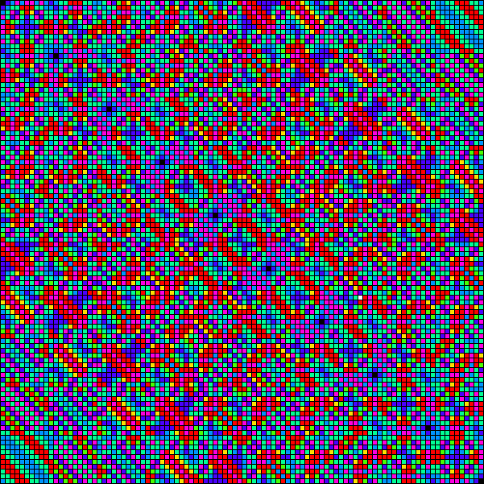
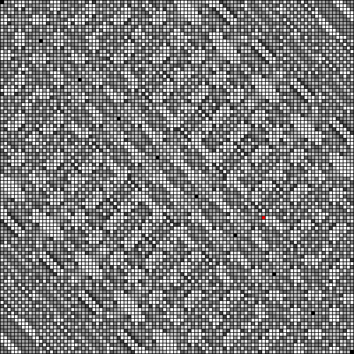
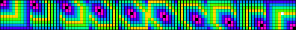
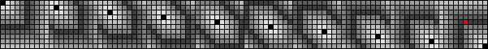

# Kaprekar's routine, constants and carpets

## Dattatreya Ramachandra Kaprekar


Dattatreya Ramachandra Kaprekar (Dahanu, Maharastra, January 17, 1905 - Deolali, Nashik District, Maharastra, June 1, 1986, Kerala, India) was an indian mathematician whose name is associated with multiple concepts in number theory. He described the Kaprekar, harshad, self and other several of classes of natural numbers, and is also known for discovering the Kaprekar's constant.

## Kaprekar's routine

It is an iterative algorithm consisting of the following steps:

  1. Choose any natural number $n$ in a given number base $b$.
  2. Create a new number $\alpha$ by sorting the digits of $n$ in descending order.
  3. Create a new number $\beta$ by sorting the digits of $n$ in ascending order.
  4. Substract $\alpha - \beta$ to produce the next $n$ number.
  5. Repeat from step 2 with the new $n$ number.

When the $\alpha$ and $\beta$ numbers are created may have leading zeros, wich could be discarted or preserved.

```python
def kaprekar(n, pad=None):
    """
    Base 10 Kaprekar's mapping for the given number
    """
    d = str(n)
    s = sorted(d.ljust(pad, "0") if pad and pad > len(d) else d)
    return int("".join(reversed(s))) - int("".join(s))
```

## Kaprekar's constants

The consecutive application of the Kaprekar's routine may result on repeating cicles or reach fixing points. These fixing points are called Kaprekar's constants.

### 6174

The 6174 number is the most famous Kaprekar's constant. It is obtained by applying at most seven iterations of the Kaprepar's routine for any base 10 four-digits number, not repdigit and preserving the leading zeros.

### 495

The second most famous Kaprekar's constant is 495. It is obtained similarly as the 6174 constant but using three-digits numbers.

## Kaprekar's carpets

Using the Kaprekar's routine with base 10 numbers when the leading zeros are preserved, Kaprekar's carpets can be built for the four-digits and three-digits cases.

The carpet is a matrix of $10^{d}$ entries, where $d$ is the number of digits for the case. Each entry represents a number in the range $[0, 10^{d} - 1]$, contains the number of iterations needed to reach the Kaprekar's constant and are arranged so that the columns represent the two least significant digits of the number, while the rows represent the two most significant digits.

```python
from copy import deepcopy
from PIL import Image

class Carpet():
    """
    Base 10 Kaprekar's carpet for four or three digits
    """

    _rgb_palette = {
        "none": (0x00, 0x00, 0x00),
        "border": (0x00, 0x00, 0x00),
        0: (0xFF, 0xFF, 0xFF),
        1: (0xFF, 0xDB, 0x01),
        2: (0x47, 0xFF, 0x01),
        3: (0x01, 0xFE, 0x91),
        4: (0x00, 0x91, 0xFE),
        5: (0x48, 0x01, 0xFF),
        6: (0xFE, 0x00, 0xDA),
        7: (0xFE, 0x00, 0x00)
    }

    _bw_palette = {
        "none": (0x00, 0x00, 0x00),
        "border": (0x00, 0x00, 0x00),
        0: (0x1F, 0x1F, 0x1F),
        1: (0x3F, 0x3F, 0x3F),
        2: (0x5F, 0x5F, 0x5F),
        3: (0x7F, 0x7F, 0x7F),
        4: (0x9F, 0x9F, 0x9F),
        5: (0xBF, 0xBF, 0xBF),
        6: (0xDF, 0xDF, 0xDF),
        7: (0xFF, 0xFF, 0xFF)
    }


    @staticmethod
    def known_palette(name):
        if name == "rgb":
            return deepcopy(Carpet._rgb_palette)
        if name == "bw":
            return deepcopy(Carpet._bw_palette)
        raise ValueError("unknown palette")

    @staticmethod
    def kaprekar(n, pad=None):
        """
        Kaprekar's mapping for the given number
        """
        d = str(n)
        s = sorted(d.ljust(pad, "0") if pad and pad > len(d) else d)
        return int("".join(reversed(s))) - int("".join(s))


    def __init__(self, digits=4, cell_size=5, border_size=1, palette="rgb"):
        """
        Constructor
        """
        self.digits = digits
        self.cell_size = cell_size
        self.border_size = border_size
        self.palette = palette


    def _coord(self, x, y):
        """
        Get the coordinate of the upper left pixel for the given cell
        """
        scale = self._cell_size + self._border_size
        return (x * scale + self._border_size, y * scale + self._border_size)

    @property
    def digits(self):
        """
        Get the number of digits
        """
        return self._n

    @property
    def cell_size(self):
        """
        Get the cell size
        """
        return self._cell_size

    @property
    def border_size(self):
        """
        Get the border size
        """
        return self._border_size

    @property
    def palette(self):
        """
        Get the palette
        """
        return deepcopy(self._palette)

    @property
    def image(self):
        """
        Get the carpet image
        """
        self.build()
        return self._img.copy()


    @digits.setter
    def digits(self, digits):
        """
        Set the number of digits
        """
        if digits != 3 and digits != 4:
            raise ValueError("only 3 and 4 are valid for the digits argument")

        self._n = digits
        self._modified = True

    @cell_size.setter
    def cell_size(self, cell_size):
        """
        Set the cell size
        """
        if cell_size < 1:
            raise ValueError("the cell size must be greater than zero")

        self._cell_size = cell_size
        self._modified = True

    @border_size.setter
    def border_size(self, border_size):
        """
        Set the cell border size
        """
        if border_size < 0:
            raise ValueError("the border size cannot be negative")

        self._border_size = border_size
        self._modified = True

    @palette.setter
    def palette(self, palette):
        """
        Set the carpet palette
        """
        if isinstance(palette, str):
            self._palette = Carpet.known_palette(palette)
        elif palette:
            palette = deepcopy(palette)
            for prop in [ "none", "border" ]:
                if not prop in palette:
                    palette[prop] = Carpet._bw_palette[prop]
            self._palette = palette
        self._modified = True

    def build(self):
        """
        Build the Kaprekar's carpet
        """
        if not self._modified:
            return

        zeros, fit = divmod(self._n, 2)
        rows = 10 ** zeros
        cols = 10 ** (zeros + fit)

        self._img = Image.new(mode="RGB", size=self._coord(cols, rows), color=self._palette["border"])
        pixel = self._img.load()

        for n in range(10 ** self._n):
            row, col = divmod(n, cols)

            k_0 = n
            k_1 = Carpet.kaprekar(k_0, self._n)
            color = None

            if k_1:
                i = 0
                while k_1 != k_0:
                    k_0 = k_1
                    k_1 = Carpet.kaprekar(k_0, self._n)
                    i += 1
                color = self._palette[i] if i in self._palette else 3 * (i,)
            else:
                color = self._palette["none"]

            x, y = self._coord(col, row)
            for l in range(x, x + self._cell_size):
                for m in range(y, y + self._cell_size):
                    pixel[l, m] = color

        self._modified = False
```
```python
from IPython.display import display

# Carpet and BW palette with red constant
carpet = Carpet()
bw = Carpet.known_palette("bw")
bw[0] = (0xFF, 0x00, 0x00)

def saveAndDisplay(img, name):
    """
    Save and display the given image
    """
    img.save(name)
    display(img)
```

### Four-digits carpet

```python
# RGB carpet
saveAndDisplay(carpet.image, "carpet4_rgb.png")

# BW carpet
carpet.palette = bw
saveAndDisplay(carpet.image, "carpet4_bw.png")
```




### Three-digits carpet

```python
# RGB carpet
carpet.digits = 3
carpet.palette = "rgb"
saveAndDisplay(carpet.image, "carpet3_rgb.png")

# BW carpet
carpet.palette = bw
saveAndDisplay(carpet.image, "carpet3_bw.png")
```



